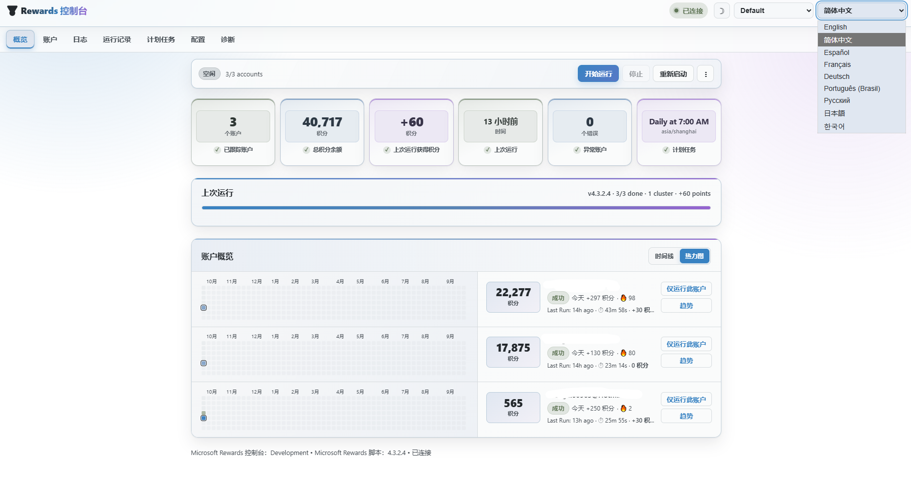
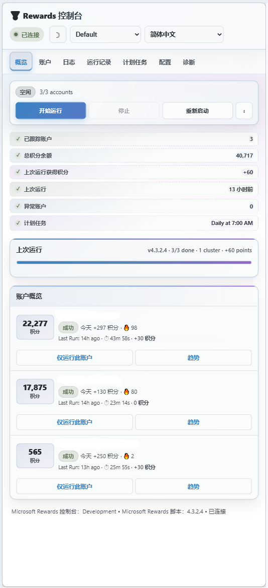

# Rewards Dashboard

`Rewards Dashboard` 是面向 Microsoft Rewards Script 的 Web 管理控制台。启用脚本的 Control API（`API_MODE=true`）并完成控制台配置后，即可通过 `http://<主机 IP>:8890` 查看账户状态、积分余额、运行记录和趋势统计，也可在网页中启动、停止、重启或计划运行任务，以及管理脚本配置。

本项目的数据保存在本地，不会将账户信息发送到第三方服务。

## 支持的 Microsoft Rewards Script 项目

| 项目 | 说明 |
| --- | --- |
| [中国本土化项目](https://github.com/chiihero/Microsoft-Rewards-Script) | 支持中文日志格式，并针对中国大陆使用场景进行了本土化适配。 |
| [原版项目](https://github.com/TheNetsky/Microsoft-Rewards-Script) | 支持原版英文日志格式及 Control API。 |

## 本分支更新

本分支在原版控制台基础上增加了以下功能：

- **中文页面支持**：新增 `English / 简体中文` 切换器，覆盖导航、控制按钮、状态信息、账户、日志、运行记录、计划任务、配置和诊断页面。
- **自动选择语言**：首次访问时根据浏览器语言选择中文或英文，之后使用浏览器本地存储记住用户选择。
- **本地化格式**：数字、日期、时间和相对时间会跟随当前界面语言显示。
- **保留英文界面**：原有英文页面仍可使用，可随时切换，不影响已有数据。
- **双项目日志兼容**：同时解析原版 Microsoft Rewards Script `4.3.2` 的英文日志，以及中国本土化项目 `4.3.2.4` 的中文日志。
- **新版统计恢复**：兼容中文 `ACCOUNT-START`、`ACCOUNT-END`、`RUN-START`、`RUN-END` 等事件，使时间线、热力图、积分历史和运行记录能够正常生成数据。
- **更多中文事件支持**：兼容账户等待、账户跳过、账户错误、流程失败、连续记录保护、集群 Worker 退出和登录批准提示。
- **PWA 缓存更新**：语言资源已加入离线缓存，缓存版本升级后可正确加载中文界面。

### 日志兼容范围

控制台根据日志标题和消息字段生成账户历史与运行统计。目前同时支持[原版项目](https://github.com/TheNetsky/Microsoft-Rewards-Script)和[中国本土化项目](https://github.com/chiihero/Microsoft-Rewards-Script)的以下两组日志格式：

| 事件 | 4.3.2 英文格式 | 4.3.2.4 中文格式 |
| --- | --- | --- |
| 运行开始 | `Starting Microsoft Rewards Script` | `启动微软奖励脚本` |
| 账户开始 | `Starting account` | `开始处理账户` |
| 账户完成 | `Completed account` | `账户完成` |
| 全部完成 | `Completed all accounts` | `全部账户完成` |
| 账户等待 | `Waiting ... seconds before starting...` | `等待 ... 秒后开始下一个账户` |
| 账户错误 | `email: error` | `email &#124; 错误=...` |
| 账户跳过 | `Skipped account` | `跳过账户` |
| 流程失败 | `Mobile/Desktop flow failed for...` | `账户的移动端/桌面端流程失败` |
| 连续记录保护 | `Snapshot complete` | `快照完成` |
| Worker 退出 | `Worker ... exit` | `worker ... 退出` |
| 登录批准数字 | `Please approve login and select number` | `请批准登录并选择数字` |

> [!IMPORTANT]
> 日志兼容更新对更新后收到的日志生效。修复前已经被跳过的历史日志不会自动重新解析；只有仍在 Control API 重放缓冲区内、且尚未被控制台标记为已处理的日志才可能重新进入解析流程。

## 截图

| 桌面端 | 移动端 |
| --- | --- |
|  |  |

## 功能

- **完全本地运行**：全部数据保存在本地，账户数据由用户自行掌控。
- **账户概览**：查看每个账户的积分、运行状态、错误信息与当天收益。
- **积分时间线与热力图**：按账户展示每日积分变化、周分隔和历史趋势；悬停可查看具体日期、积分变化和总余额。
- **无密码登录批准**：检测日志中的两位批准数字，并显示 60 秒实时倒计时。
- **持久化历史**：解析后的事件写入本地 SQLite 数据库，控制台或机器人重启后仍保留数据。
- **实时运行状态**：显示当前任务进度、已处理账户、获得积分和下一个账户等待时间。
- **运行控制**：支持开始、停止、重启、强制停止以及关闭 Control API。
- **计划任务**：支持控制台本地调度器和机器人容器调度器，并可排除指定账户。
- **配置管理**：可视化修改常用配置，也可通过原始 JSON 编辑器提交差异配置。
- **实时日志**：通过 SSE 显示日志，支持级别筛选、搜索、暂停、自动滚动、下载和清空。
- **诊断工具**：查看错误文本、截图、HTML 页面转储，并可清除账户登录会话。
- **主题支持**：保留 Nord、Dracula、Catppuccin、Gruvbox、Tokyo Night 等主题。
- **响应式布局**：针对移动设备提供简化布局。
- **中英文界面**：支持简体中文与英文即时切换。

## Docker 快速开始

1. 在机器人服务中启用 Control API：

   ```env
   API_MODE=true
   API_TOKEN=请填写足够长的随机字符串
   ```

   然后选择下文的“暴露 `3010` 端口”或“外部 Docker 网络”方案，使 Dashboard 能够连接 Control API。

> [!TIP]
> 如果需要通过控制台修改机器人计划任务和配置，还需在机器人服务中启用 `API_ALLOW_SCHEDULE_WRITE=true` 和 `API_ALLOW_CONFIG_WRITE=true`。

2. 在仓库根目录将环境变量模板复制为 `.env`：

   Linux 或 macOS：

   ```bash
   cp env.example .env
   ```

   Windows PowerShell：

   ```powershell
   Copy-Item env.example .env
   ```

   以上步骤适用于 Dashboard 使用独立 `compose.yaml` 启动的情况。Microsoft Rewards Script 仍使用它自己的 `env.example` 和 `.env` 保存账户信息及 `API_TOKEN`。

3. 编辑 `.env`，至少确认以下配置。`CONTROL_API_TOKEN` 必须与机器人服务的 `API_TOKEN` 完全一致：

   ```env
   CONTROL_API_TOKEN=请填写与机器人相同的令牌
   TZ=Asia/Shanghai
   ```

   `CONTROL_API_URL` 取决于连接方式：暴露宿主机端口时使用 `http://host.docker.internal:3010`，通过外部网络连接时使用 `http://microsoft-rewards-script:3010`。

   如果将本项目的 `rewards-dashboard` 服务合并到 Microsoft Rewards Script 的 `compose.yaml`，组合配置将以机器人项目目录为根，并直接使用机器人的 `.env`。此时无需再为 Dashboard 创建单独的 `.env`，在 Dashboard 服务中将令牌映射为 `CONTROL_API_TOKEN: "${API_TOKEN}"` 即可。

> [!IMPORTANT]
> 合并 `compose.yaml` 前，还必须将本项目内层的 `rewards-dashboard` 目录完整复制到 Microsoft Rewards Script 项目根目录，否则 `build.context: ./rewards-dashboard` 无法找到 Dashboard 的 `Dockerfile` 和源代码。

合并后的目录结构应类似：

```text
Microsoft-Rewards-Script/
├─ compose.yaml
├─ .env
├─ config/
├─ sessions/
└─ rewards-dashboard/
   ├─ Dockerfile
   ├─ package.json
   ├─ server.js
   ├─ lib/
   └─ public/
```

4. 编译构建 Dashboard Docker 镜像：

   ```bash
   docker compose build rewards-dashboard
   ```

   本地构建默认显示 `Development`。发布镜像由 GitHub Actions 将 Git 标签通过
   `APP_VERSION` 构建参数写入 `public/version.js`；如需本地指定版本，可执行：

   ```bash
   docker compose build --build-arg APP_VERSION=v1.2.2 rewards-dashboard
   ```

   GitHub Release 页面中的 `Source code (zip)` 是 GitHub 自动生成的源码快照，保留开发文件中的
   `Development` 标记。发布工作流会额外上传 `rewards-dashboard-vX.Y.Z.zip`，该压缩包会将
   `public/version.js` 写入对应的 Git 标签版本；部署时请优先下载这个版本化压缩包。

5. 启动容器：

   ```bash
   docker compose up -d
   ```

   也可以使用一条命令完成重新构建和启动：

   ```bash
   docker compose up -d --build
   ```

6. 查看容器状态，确认服务正常运行：

   ```bash
   docker compose ps
   ```

7. 浏览器访问 `http://<主机 IP>:8890`。

### Control API 连接方式

以下两种方式任选其一，不需要同时配置。

#### 方案一：暴露 `3010` 端口

在 `microsoft-rewards-script` 服务中映射 Control API 端口：

```yaml
ports:
  - "3010:3010"
```

Dashboard 使用宿主机地址连接：

```env
CONTROL_API_URL=http://host.docker.internal:3010
```

Linux Docker 还需在 `rewards-dashboard` 服务中加入：

```yaml
extra_hosts:
  - "host.docker.internal:host-gateway"
```

Dashboard 服务合并片段参见 [sample-stack-compose-port.yaml](sample-stack-compose-port.yaml)。此方案会将 Control API 暴露到宿主机；请设置足够强的 `API_TOKEN`，并通过防火墙限制不必要的外部访问。

#### 方案二：外部 Docker 网络

先创建外部网络：

```bash
docker network create rewards-network
```

将 `microsoft-rewards-script` 和 `rewards-dashboard` 服务同时加入该网络：

```yaml
networks:
  - rewards-network

networks:
  rewards-network:
    name: rewards-network
    external: true
```

Dashboard 通过机器人容器名称连接，无需向宿主机暴露 `3010` 端口：

```env
CONTROL_API_URL=http://microsoft-rewards-script:3010
```

Dashboard 服务及外部网络合并片段参见 [sample-stack-compose.yaml](sample-stack-compose.yaml)。推荐使用此方案，将 Control API 保留在 Docker 网络内部。合并时还需把机器人现有的 `microsoft-rewards-script` 服务加入 `rewards-network`。

## 裸机快速开始

需要 Node.js `22.13+`，因为项目使用内置的 `node:sqlite`。控制台本身不依赖第三方 npm 包。

先在机器人项目中启动 Control API：

```bash
API_TOKEN=some-long-random-string node scripts/api/server.js
```

然后配置并启动控制台。`CONTROL_API_TOKEN` 必须与机器人的 `API_TOKEN` 相同：

```bash
cp rewards-dashboard/env.example rewards-dashboard/.env
# 编辑 CONTROL_API_URL 和 CONTROL_API_TOKEN
cd rewards-dashboard
npm start
# 浏览器访问 http://localhost:8890
```

## 身份验证

控制台浏览器登录保护由以下变量独立控制：

```env
DASHBOARD_USERNAME=用户名
DASHBOARD_PASSWORD=密码
```

只有两个值都不为空时，HTTP Basic Authentication 才会启用。任意一个为空，浏览器访问控制台时都不会出现登录提示。

这不会关闭控制台与机器人 Control API 之间的身份验证。无论是否启用浏览器登录保护，`CONTROL_API_TOKEN` 仍必须与机器人的 `API_TOKEN` 一致。

## 可选的 Control API 权限

以下功能由机器人 Control API 控制，默认关闭：

| 在 Control API 中设置 | 解锁功能 |
| --- | --- |
| `API_ALLOW_SCHEDULE_WRITE=true` | 允许控制台修改机器人容器中的计划任务。 |
| `API_ALLOW_CONFIG_WRITE=true` | 允许“配置”页面保存更改；未启用时配置为只读，保存会返回 `403`。 |
| `API_ALLOW_CONFIG_REVEAL=true` | 允许“配置”页面显示敏感字段；未启用时 Webhook URL 和令牌显示为 `***REDACTED***`。 |

## 页面说明

### 概览

显示账户数量、总积分、上次运行收益、异常账户和下次计划运行等统计卡片。任务运行期间还会显示实时进度、已完成/运行中/等待中的账户数量，以及每个账户的积分时间线或热力图。

### 账户

将机器人 `.env` 中配置的账户与日志中实际观察到的数据合并展示，包括当前余额、当天收益、运行状态、连续签到、连续记录保护、地区、语言、TOTP 与恢复邮箱是否已配置、代理地址及认证状态，以及历史运行数据。还支持单账户运行、批量运行和删除控制台中的账户历史。

账户凭据仍由机器人的 `.env` 管理，本页面不会编辑密码、TOTP 密钥、恢复邮箱或代理凭据。

### 日志

通过 SSE 实时显示 Control API 日志，支持日志级别筛选、文本搜索、暂停并缓冲、自动滚动、加载更多、下载和清空。

### 运行记录

显示最近 `14 / 30 / 90` 天的每日积分图表、机器人运行历史和进程退出记录。即使进程崩溃而没有输出 `RUN-END`，Control API 的退出状态仍可用于结束运行记录，避免任务永久显示为“运行中”。

时间线、热力图和每日积分图表的数据主要来自成功解析的 `ACCOUNT-END` 事件。

### 计划任务

支持两种调度位置：

- **当前控制台**：计划任务运行在控制台进程中，支持错过运行策略。
- **机器人容器**：使用机器人容器内部的 Docker cron，控制台离线时仍可触发。

可设置 Cron 表达式、预设时间、排除账户、错过运行策略和“已有任务运行时跳过”。如果两种调度器同时启用，页面会提示可能重复运行。

### 配置

用于管理机器人的 `config.json`。常用选项提供可视化控件，也可直接编辑原始 JSON。保存时只发送实际变化的字段，不会提交完整配置；敏感字段保持脱敏，防止 `***REDACTED***` 覆盖真实令牌。Control API 的配置校验错误会直接显示在页面中。

### 诊断

可以查看机器人保存的错误文本、截图和 HTML 页面转储。还可查看账户会话状态并清除会话，用于处理常见登录问题。

清除会话会立即登出对应账户，下次运行时需要重新登录，并可能需要重新完成双重验证。

## 工作原理

### 单一 SSE 连接

控制台服务器只维持一条到 Control API 的事件流，再通过 `lib/eventHub.js` 广播给所有浏览器标签页。它支持 `Last-Event-ID` 恢复和断线重连退避，即使同时打开十个页面，机器人侧仍只需一条连接。

### 两条数据路径

原始日志通过 SSE 实时发送到浏览器，同时经过 `lib/parser.js` 解析后写入 `lib/store.js` 管理的 SQLite 数据库。Control API 的内存日志缓冲区会随进程退出而消失，而控制台数据库中的积分历史、运行记录、活动和本地计划任务可以跨重启保留。

### 日志解析与版本兼容

`lib/parser.js` 首先移除 Docker 添加的 RFC3339 时间戳和 ANSI 颜色码，然后解析应用日志：

```text
[本地时间] [用户] [级别] 平台 [标题] 消息
```

解析器根据稳定的事件标题（例如 `ACCOUNT-END`）选择对应规则，再将英文或中文消息转换成相同的内部事件结构：

```js
{
  kind: "account-end",
  email: "user@example.com",
  gained: 50,
  oldPoints: 1000,
  newPoints: 1050,
  durationSec: 30
}
```

因此 `4.3.2` 英文日志和 `4.3.2.4` 中文日志最终都会写入相同的数据库字段，前端图表无需区分日志语言。

### 实时积分

机器人在运行过程中会输出余额和积分变化，Control API 将解析后的实时状态放入 `/status`，并通过 `/events` 的 `status` 事件推送完整状态快照。控制台同时轮询 `/status` 并接收 SSE 状态更新，因此任务尚未结束时也能显示实时积分；账户结束后，以 `ACCOUNT-END` 中的最终数据作为权威结果。

### 独立的两层认证

- `CONTROL_API_TOKEN`：控制台服务器访问机器人 Control API 时使用的 Bearer Token。
- `DASHBOARD_USERNAME` / `DASHBOARD_PASSWORD`：浏览器访问控制台时使用的 Basic Authentication。

两层认证互相独立。

### 无第三方 npm 运行依赖

控制台服务器不依赖第三方 npm 包。图表使用 `public/charts.js` 生成内联 SVG，并通过 CSS 变量读取主题颜色，因此可以跟随主题显示；原版提供的主题均保留。

## 环境变量

| 变量 | 默认值 | 说明 |
| --- | --- | --- |
| `CONTROL_API_URL` | `http://microsoft-rewards-script:3010` | Control API 地址。 |
| `CONTROL_API_TOKEN` | 空 | 发送给 Control API 的 Bearer Token，必须与机器人的 `API_TOKEN` 相同。 |
| `DASHBOARD_USERNAME` | 空 | 可选的控制台 Basic Auth 用户名。 |
| `DASHBOARD_PASSWORD` | 空 | 可选的控制台 Basic Auth 密码；用户名和密码必须同时设置。 |
| `PORT` | `8890` | 控制台 HTTP 监听端口。 |
| `TZ` | `UTC` | 控制台时区，用于将积分记录归入正确日期。 |
| `DASHBOARD_TITLE` | `Microsoft Rewards` | 控制台显示名称。 |
| `POLL_MS` | `5000` | 状态轮询间隔，单位为毫秒；日志使用 SSE 推送。 |
| `LOG_REPLAY` | `300` | SSE 连接建立时重放的日志行数。 |
| `DATA_DIR` | `./data` | `dashboard.sqlite` 所在目录；Docker 中默认为 `/data`。 |

## 数据与隐私

- 控制台数据库默认位于 `DATA_DIR/dashboard.sqlite`。
- 浏览器界面可能显示完整邮箱地址，但不会从 Control API 接收密码、恢复邮箱内容、TOTP 密钥或代理密码。
- 日志和诊断内容可能包含邮箱、错误信息或页面截图，请妥善保护控制台访问权限和数据目录。
- 删除账户历史只会删除控制台数据库中的状态、历史和活动，不会修改机器人 `.env` 中的账户配置。

## 升级说明

升级到包含中文日志兼容的版本后：

1. 执行 `docker compose up -d --build` 重新构建并启动控制台容器。
2. 浏览器执行一次强制刷新，或等待新版 Service Worker 接管页面。
3. 启动一次机器人任务。
4. 在“账户”和“运行记录”页面确认新任务已产生积分历史。

如果修复前的中文日志已经被控制台读取，它们可能已作为普通日志跳过，不会自动补写到历史数据库。建议保留现有数据库，并从下一次运行开始积累数据；只有在明确接受丢失旧控制台历史时，才考虑重新创建数据库。

## 故障排查

### 无法连接 Control API

检查 `CONTROL_API_URL`。Docker 容器中的 `localhost` 指向控制台容器本身，应使用机器人服务名称，或配合 `extra_hosts` 使用 `host.docker.internal`。

### Control API 拒绝令牌

确认 `CONTROL_API_TOKEN` 与机器人的 `API_TOKEN` 完全一致。

### 浏览器没有出现登录提示

必须同时设置非空的 `DASHBOARD_USERNAME` 和 `DASHBOARD_PASSWORD`。缺少任意一个值都会关闭浏览器登录保护。

### 保存配置返回 403

在机器人 Control API 环境中启用 `API_ALLOW_CONFIG_WRITE=true`。

### 无法显示敏感配置

在机器人 Control API 环境中启用 `API_ALLOW_CONFIG_REVEAL=true`。建议同时启用 `API_TOKEN`，不要将允许显示敏感配置的 API 暴露到不可信网络。

### 每日积分在错误的时间换日

正确设置控制台的 `TZ`，例如 `TZ=Asia/Shanghai`。

### 计划任务没有触发

检查调度器位置、Cron 表达式、启用状态、排除账户、错过运行策略、上次运行结果，以及是否同时启用了两个调度器。

### 时间线或热力图没有数据

依次检查：

1. 日志中是否存在 `ACCOUNT-END`；
2. 英文日志是否包含 `Completed account`；
3. 中文日志是否包含 `账户完成`、`获得积分`、`原余额`、`现余额` 和 `持续秒数`；
4. 控制台是否已更新到包含双格式解析器的版本；
5. 更新后是否至少完整运行过一次机器人任务；
6. `DATA_DIR` 是否可写，且 `dashboard.sqlite` 是否被正确持久化。

### 中文界面没有生效

- 使用页面右上角的语言选择器切换到“简体中文”；
- 强制刷新浏览器页面；
- 如果以 PWA 安装，关闭后重新打开；
- 确认 `public/i18n.js` 可以从服务器正常访问；
- 确认浏览器没有继续使用旧版 Service Worker 缓存。

## 项目结构

```text
rewards-dashboard/
├─ compose.yaml                        # Dashboard 独立部署配置
├─ env.example                         # Docker 部署环境变量模板
├─ sample-stack-compose.yaml           # Dashboard 合并片段：外部网络方案
├─ sample-stack-compose-port.yaml      # Dashboard 合并片段：3010 端口方案
├─ docs/                               # README 截图
└─ rewards-dashboard/                  # 需要复制到机器人项目的应用目录
   ├─ Dockerfile
   ├─ package.json
   ├─ env.example                      # 裸机运行环境变量模板
   ├─ server.js                        # HTTP 服务、API 路由和事件接入
   ├─ lib/
   │  ├─ apiClient.js                  # Control API 客户端和 SSE 日志转换
   │  ├─ eventHub.js                   # SSE 连接与浏览器广播
   │  ├─ parser.js                     # 英文/中文日志解析器
   │  ├─ store.js                      # SQLite 数据存储与状态归并
   │  └─ scheduler.js                  # 控制台本地计划任务
   └─ public/
      ├─ app.js                        # 前端入口和全局控制
      ├─ i18n.js                       # 中英文界面翻译与语言状态
      ├─ charts.js                     # SVG 图表、时间线和热力图
      ├─ sw.js                         # PWA 离线缓存
      └─ views/                        # 各标签页实现
```

## 仓库信息

| 项目         | 信息                                                                                                      |
| ------------ | --------------------------------------------------------------------------------------------------------- |
| 上游仓库     | [mgrimace/rewards-dashboard](https://github.com/mgrimace/rewards-dashboard)（main 分支）    |
| 本仓库       | [zhang00963/rewards-dashboard](https://github.com/zhang00963/rewards-dashboard) `main` 分支 |
| 应用包版本   | `1.2.2`；前端开发环境显示 `Development`，Docker 发布镜像通过 `APP_VERSION` 构建参数写入 `rewards-dashboard/public/version.js` |
| 最后同步上游 | 2026-10-01                                                                                                |
